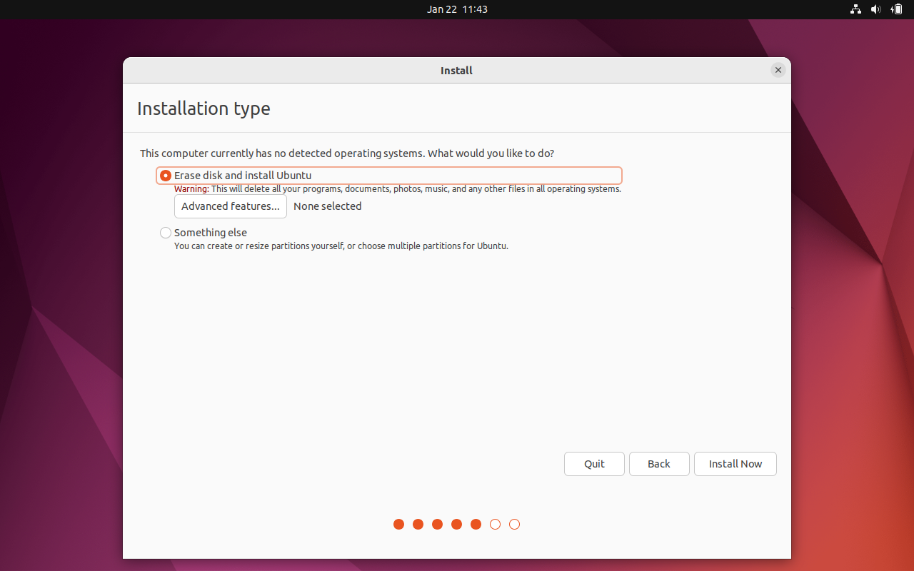
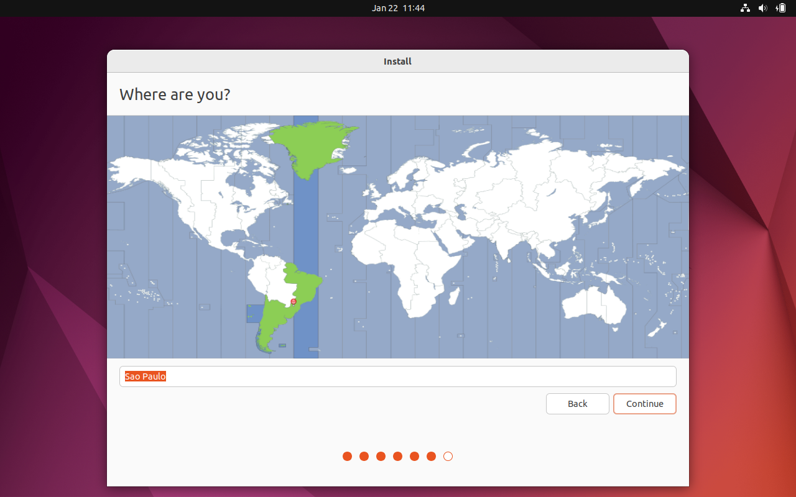

# Tutorial Instalação Linux UBUNTU

## Baixar a ISO mais recente, versão LTS:
Link para download:
- [Ubuntu](https://ubuntu.com/download/desktop) - (ISO UBUNTU)

## Instalar o VirtualBox para Windows:
Link para download:
- [VirtualBox](https://www.virtualbox.org/wiki/Downloads) - (Baixar a versão para Windows Hosts)
- Instalar o VirtualBox com todas as opções padrão sugeridas: 

## Passo 1:
- Criar uma nova VM, seguir as especificações das imagens (nome, seleção da ISO):  

  
  
  
  


## Passo 2:
- Iniciar a VM e seguir o passo a passo da instalação:  

Selecionar selecionar o idioma de exibição e depois **Install Ubuntu**:

  

Selecionar o idioma do **teclado**:  

  

__Continue__:  

  

__Install Now__:  

  

__Continue__:  

  

__Continue__:  

  

Preencher os dados de usuário e senha e __Continue__:  

  

Aguardar a instalação e reiniciar:  

  

```cmd
root@izaias-VirtualBox:/home/izaias# sh /media/izaias/VBox_GAs_7.0.14//VBoxLinuxAdditions.run
```
